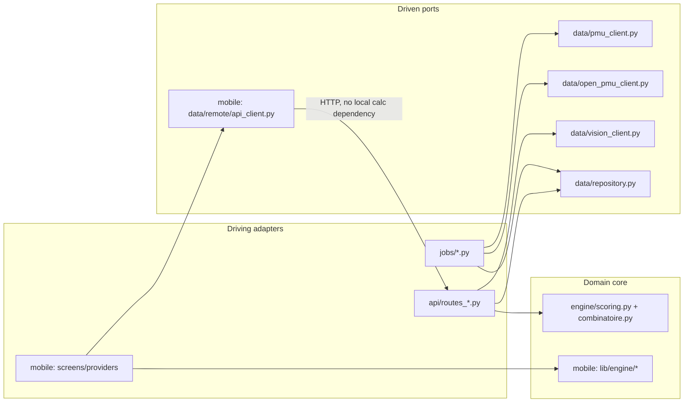

# Architecture Spine — prediction-hyppique

## Design Paradigm

**Hexagonal (ports and adapters)** — ratified from the existing codebase, not invented.

- **Domain core** (`backend/app/engine/`) — `scoring.py`, `combinatoire.py`, `constants.py`. Pure functions and dataclasses; zero dependency on FastAPI, SQLAlchemy, or any I/O library. This is the one piece both backend and mobile re-implement (Python here, Dart in `mobile/lib/engine/`) — see AD-2 for how the two stay in sync.
- **Driven ports (adapters the core doesn't know about)** — `data/pmu_client.py`, `data/open_pmu_client.py`, `data/vision_client.py` (AD-3), `data/repository.py`. Each is the *only* module that knows its external format; nothing else reads a raw PMU/vision JSON field or a raw SQL row.
- **Driving adapters** — `api/routes_*.py` (FastAPI), `jobs/*.py` (scheduled ingestion), the Flutter `screens/`+`providers/` layer. These call into the core/ports; the core never calls back into them.



## Invariants & Rules

### AD-1 — Hexagonal boundary is binding, not advisory

- **Binds:** all backend modules (`app/engine/`, `app/data/`, `app/api/`, `app/jobs/`) and their mobile mirrors (`lib/engine/`, `lib/data/`, `lib/screens/`+`lib/providers/`).
- **Prevents:** a future story reaching around the port to call an external format directly (e.g. a route parsing raw PMU JSON, or a screen calling Anthropic directly instead of through the backend `/extraction/*` endpoints — already an explicit NFR, PRD §8).
- **Rule:** `engine/` never imports from `data/`, `api/`, or any I/O/HTTP library. `data/*_client.py` and `data/vision_client.py` are the only modules that deserialize their respective external formats — every other module receives already-normalized dataclasses/models. [ADOPTED]

### AD-2 — Backend/mobile engine parity via shared fixtures, not hand-duplicated tests or constants

- **Binds:** `backend/app/engine/` (`scoring.py`, `combinatoire.py`, `constants.py`), `backend/tests/test_scoring.py`, `backend/tests/test_combinatoire.py`, `mobile/lib/engine/`, `mobile/test/engine/scoring_test.dart`.
- **Prevents:** the Python and Dart ports of the scoring engine silently diverging — either because a story on one side adds a test case or a default parameter that never gets mirrored to the other, **or** because the four coefficient tables (terrain, niveau, incidents, récence) get hand-copied once and then edited independently later. Both are the same failure shape; scoping the fix to test cases alone would leave the constants tables — an equally real divergence point — uncovered.
- **Rule:** two files at the repository root (neutral — owned by neither `backend/` nor `mobile/`):
  - `fixtures/engine_cases.json` — every test case expressible as fixed-input → fixed-or-tolerance-checked-output (probability-sum invariants, Bayesian-shrinkage bounds, the value/Kelly worked example, terrain/niveau=`None` neutrality) **and** the canonical default engine parameters (mirrors `DEFAULT_PARAMETERS` in `constants.py` / `EngineParams()` in Dart). Both `test_scoring.py`/`scoring_test.dart` and both production default-parameter objects are generated from or validated against this file — never hand-encoded independently.
  - `fixtures/engine_constants.json` — the four coefficient tables (`TERRAIN_COEFFICIENTS_GRASS`, `TERRAIN_COEFFICIENTS_PSF`, `NIVEAU_COEFFICIENTS`, `INCIDENTS`, `RECENCE_STD`/`FORME`/`FLAT`). `constants.py` and `constants.dart` both load or are validated against this file, never re-typed by hand on either side.
  - **Monte-Carlo carve-out:** `couple_place`/`deux_sur_quatre` results (from `monte_carlo_place_probabilities` in Python, its Dart equivalent) are **not** eligible for exact cross-language fixture comparison — `numpy.random.default_rng` and Dart's `Random` are different algorithms, so identical seeds do not produce identical draws. These stay covered by same-language determinism/seed-sensitivity tests only (already the shape of `test_monte_carlo_place_deterministe_avec_seed_fixe`); cross-language parity for this family is a statistical-tolerance check (e.g. both within N% of the same analytically-expected range), never a fixture equality assertion.
  - Comparative/structural tests that assert a *relationship* between two computed results in the same test (disqualification-vs-chute ordering, désordre/ordre ratio growth by depth) stay hand-written per language — they encode the property in the assertion itself, not a value that can silently drift. [decided this run; widened after adversarial + rubric-walker review]

### AD-3 — Vision extraction is an isolated, budget-guarded port

- **Provenance:** the vendor choice (Anthropic Claude) is a decision made *in this session* by the user — it does not trace to the PRD, either cahier des charges, or the brief. Re-verify the exact model name/version against Anthropic's current lineup before pinning it in `vision_client.py`; do not assume the model string used in the old JS prototype (`claude-sonnet-4-6`) is still current.
- **Binds:** `backend/app/data/vision_client.py` (not yet created), `backend/app/api/routes_analyse.py` (`/extraction/fiche`, `/extraction/programme`).
- **Prevents:** (a) an Anthropic API key or raw vision-provider call shape leaking outside one module — mirrors AD-1 for the PMU adapters, and is the mechanism behind the PRD's "no third-party API key client-side" acceptance criterion (cahier mobile §11); (b) a runaway loop or logic bug silently exhausting a paid-per-call budget with no operator visibility.
- **Rule:** `vision_client.py` is the sole module that knows the Anthropic request/response shape, exposing normalized `extract_fiche_cheval(image) -> FicheChevalExtraite` / `extract_programme(image) -> ProgrammeExtrait`. It enforces a daily call counter (in-memory or a simple DB table) against a configurable ceiling (`VISION_DAILY_CALL_LIMIT` env var) — past the ceiling, calls are refused and logged loudly rather than silently continuing. The ceiling's actual value is intentionally not fixed here — it's the PRD's own open question (§9.4, §11.4). [decided this run]

### AD-4 — API responses are typed, never raw `.__dict__` dumps

- **Binds:** every FastAPI route returning engine results (`api/routes_analyse.py` today; any future route with the same shape).
- **Prevents:** two spine-compliant stories drifting apart because one adds a field by mutating `HorseAnalysis` and letting `__dict__` carry it through untyped, while another "fixes" the endpoint to strictly match the `HorseOut` Pydantic schema — each is a reasonable reading of currently-uncodified behavior, and they produce different wire payloads.
- **Rule:** every API response is built from its declared Pydantic schema (`response_model` on the route, or an explicit `.model_validate(...)`/constructor call) — never `some_dataclass.__dict__` passed straight into a `Dict`-typed response field. **Existing violation, not hypothetical:** `routes_analyse.py`'s `/analyse` currently does exactly this (`resultats=[horse.__dict__ for horse in results]` typed as `List[Dict]` in `AnalyseOut`, bypassing the already-defined `HorseOut` schema) — logged as a fix-forward item in `deferred-work.md`, not silently left as an example to copy. [decided this run, adversarial review]

### AD-5 — Terrain/niveau travel as canonical label strings, never pre-resolved floats

- **Binds:** the `Performance`/`CourseTarget` wire shape (API JSON, DB storage) on both backend and mobile; `constants.py`'s `terrain_coefficient()` and its Dart equivalent; the not-yet-existing `niveauCoefficient()`-equivalent lookup on the mobile side.
- **Prevents:** one side sending a resolved float (`1.0`) and the other a label (`"Bon"`) for the same concept — silently "working" until a label the receiving side's lookup table doesn't recognize arrives, at which point today's code coerces it to the same neutral value used for genuinely-missing data, making the two cases indistinguishable in logs or the UI's "terrain inconnu" counter (cahier backend §7.5, PRD FR-5).
- **Rule:** `terrain` and `niveau` are transmitted and stored as their canonical French label strings (`"Bon"`, `"Catégorie B"`, …) — coefficient resolution happens only at the point of use, via each side's own mirrored lookup table (`terrain_coefficient()` today; `niveauCoefficient()` needs writing on the mobile side — currently missing per adversarial review). An **unrecognized** label is a distinct, logged condition (`terrain_label_unrecognized` or equivalent) — never silently collapsed into the same code path as a `null`/genuinely-absent value, even though both currently resolve to the same neutral coefficient (`1.0`) for the calculation itself. [decided this run, adversarial review]

## Consistency Conventions

| Concern | Convention |
| --- | --- |
| Naming (entities, fields) | French domain vocabulary end-to-end — `nom`, `cote`, `dossard`/`num_pmu`, `forme`, `score`, `probabilite`, `value`, `kelly`, `mise`, `inedit`, `partants`. Identical spelling in Python dataclasses, JSON API payloads, and Dart models — never translated to English — **for the engine-facing shape** (`HorseAnalysis`/`Performance` and their JSON mirror). A DB/API schema serving a genuinely different bounded context (e.g. `ParticipationOut`'s course-specific `age_a_la_course`/`cote_reference` vs. the ad-hoc-analysis `HorseIn`'s `age`/`cote`) may legitimately use different names for an equivalent concept — the requirement is that the translation between them happens in one explicit mapping function (already the pattern: `_build_horse_analysis()`), never implicitly assumed identical. [narrowed after adversarial review — the original unqualified claim didn't hold for `ParticipationOut` vs `HorseIn`] |
| Data & formats | A cross-course-stable horse identity is the normalized name (`nom_normalise`); `num_pmu` is valid only within one course (cahier backend §6.2 — a documented pitfall, not a design choice made here). `terrain`/`niveau`/`distance` on a `Performance` are nullable and mean "neutral coefficient," never a guessed default — this rule already governs the engine (§7.5) and extends verbatim to every future field with the same shape (see AD-5 for the wire-format corollary). |
| State & cross-cutting | Mobile local calculation never depends on network reachability once a course is cached (PRD FR-13); the two network-dependent features (photo import, live-odds refresh) fail visibly and leave the rest of the screen usable (FR-15). No third-party API key ever ships in the mobile binary (AD-3). API responses are always typed (AD-4). |

## Stack

| Name | Version |
| --- | --- |
| Python | 3.12 (`backend/Dockerfile`) — bugfix support has ended; security-fix-only until Oct 2028. Not a blocker, worth knowing before a future story picks a 3.12-only feature that later needs backporting. |
| FastAPI | latest at `requirements.txt` resolution (unpinned) [ASSUMPTION: acceptable for a solo bootstrap backend; pin if this becomes a concern] |
| SQLAlchemy | latest at `requirements.txt` resolution (unpinned) [ASSUMPTION: same risk as FastAPI, same acceptance for now] |
| Flutter/Dart | Flutter 3.47.1 / Dart 3.13.1 current stable, verified compatible with `mobile/pubspec.yaml`'s `sdk: ^3.12.0` constraint (verified this run — replaces prior hedge) |
| Riverpod | `^3.4.2`, mobile state management [ADOPTED — cahier mobile §5.1; verified current major line] |
| sqflite | `^2.4.3`, mobile local cache [ADOPTED — cahier mobile §9; verified current, not deprecated] |
| dio | `^5.11.0`, mobile HTTP client [ADOPTED — cahier mobile §9, chosen over `http` for timeout/retry handling on unreliable trackside connections; verified current] |
| freezed + json_serializable | per `mobile/pubspec.yaml`, mobile model codegen [ADOPTED — cahier mobile §9, immutable models + JSON parity with backend schemas] |
| Vision provider | Anthropic Claude — model name/version deliberately left unpinned here; see AD-3 Provenance. Not sourced from any prior planning document. |

## Structural Seed

```text
{repo-root}/
  fixtures/
    engine_cases.json       # AD-2: shared test cases + canonical default params
    engine_constants.json   # AD-2: shared terrain/niveau/incidents/recence tables
  backend/
    app/
      engine/                # domain core (hexagon center)
      data/                  # driven ports/adapters
      api/                   # driving adapters (HTTP)
      jobs/                  # driving adapters (scheduled)
  mobile/
    lib/
      engine/                # domain core, Dart mirror
      data/                  # driven ports/adapters, Dart mirror
      screens/ + providers/  # driving adapters (UI)
    test/engine/              # loads fixtures/engine_cases.json (AD-2)
```

## Deferred

- **Deployment/environments beyond what `docker-compose.yml` already fixes.** Two self-hosted services (`api`, `ingestion`) sharing a SQLite volume are already [ADOPTED] from the existing compose file — that's not re-decided here. No CI/CD pipeline, no staging environment, and no mobile store distribution exist yet; deferred by explicit project posture (brief §6, PRD §9.3/§10 — bootstrap, no fixed timeline, traction-gated). Revisit when a second environment or a release channel is actually needed.
- **`VISION_DAILY_CALL_LIMIT`'s actual value and the vision budget it protects.** Mechanism fixed (AD-3); the number is PRD Open Question 4 (§9.4, §11.4) — not an architecture decision.
- **Niveau-from-allocation quantile calibration** (cahier backend §7.2, PRD Open Question 5) — a data-calibration task once real ingested volume exists, not a structural decision.
- **Homonym disambiguation for `nom_normalise`** (PRD Open Question 7) — accepted risk until a real collision surfaces; no structural hook needed today.
- **Payment/account/multi-user architecture.** Explicitly out of MVP scope (PRD §6.2, §9.1) — revisit only once the V2 monetization gate (PRD §10) is met.
